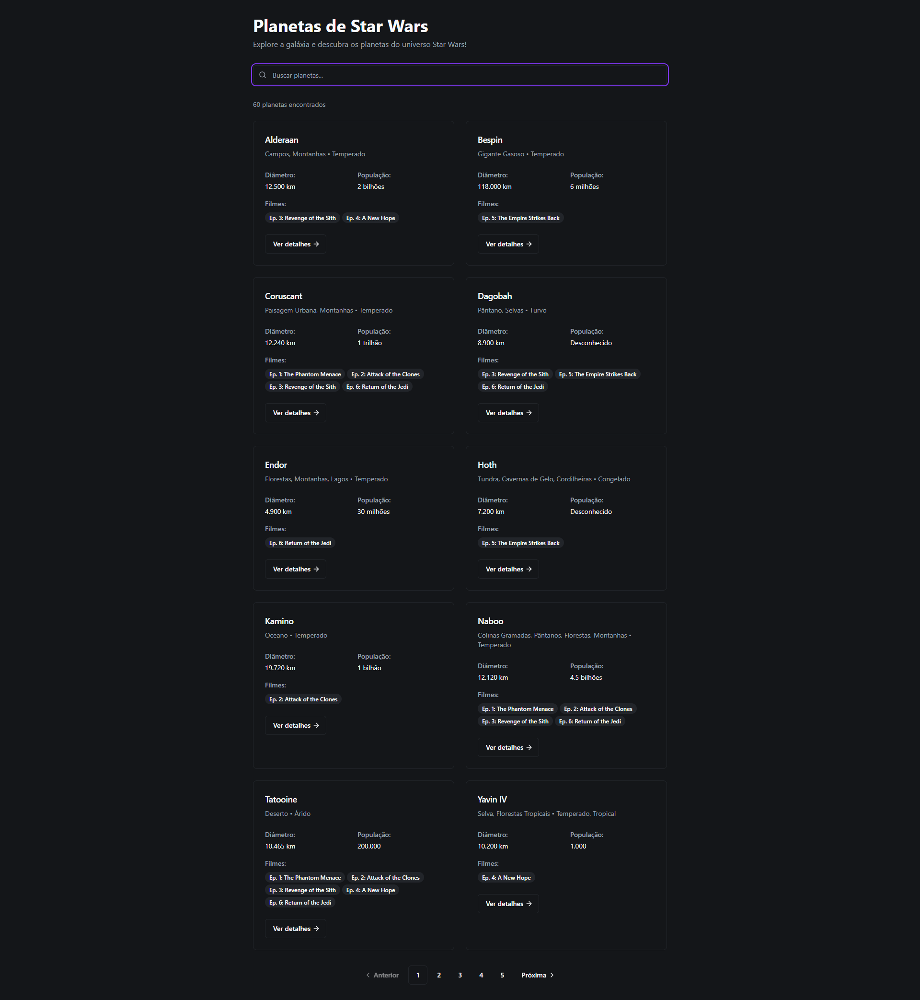
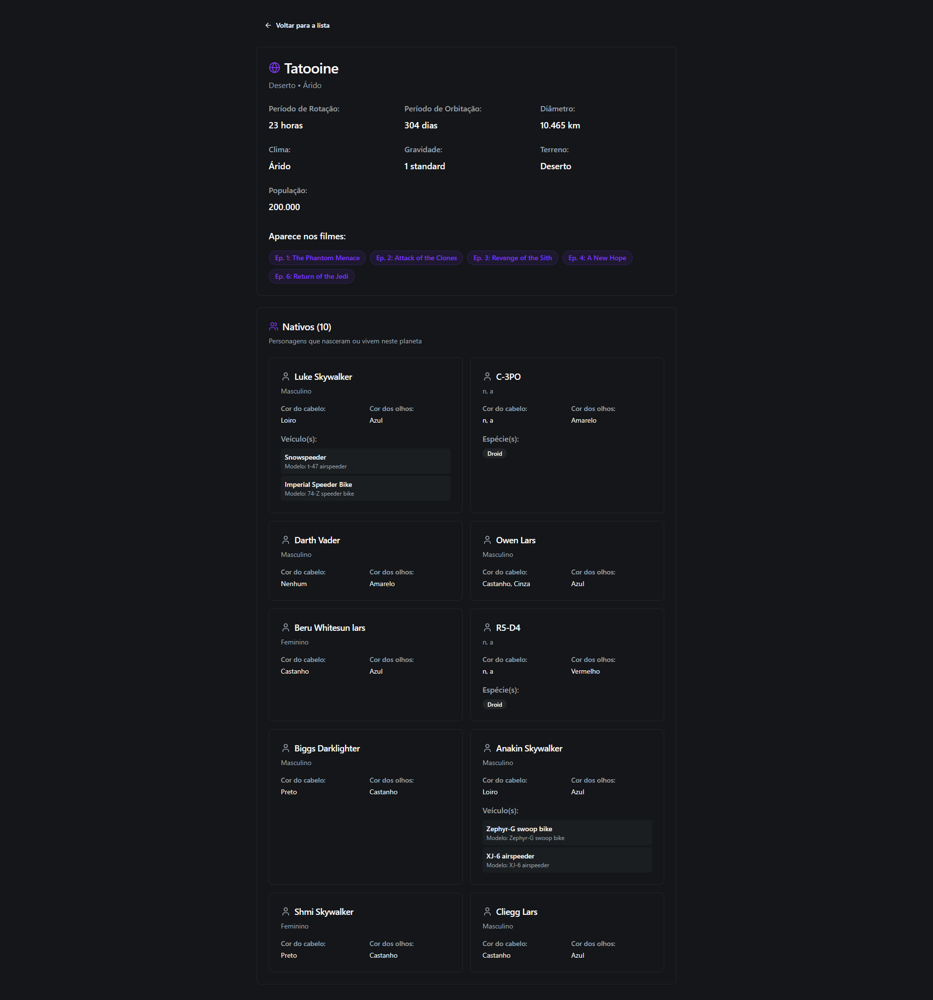

# Star Wars Planets

Aplicação web para explorar planetas do universo Star Wars usando a SWAPI.

## 📸 Screenshots

### Listagem de Planetas


### Detalhes do Planeta


## 🛠 Tecnologias

- React 19 + TypeScript
- Vite
- React Router DOM
- TanStack Query (React Query)
- Tailwind CSS
- shadcn/ui + Radix UI
- Vitest + Testing Library + Cypress

## 🚀 Instalação e Execução

```bash
# Instalar dependências
npm install

# Executar em desenvolvimento
npm run dev

# Testes unitários (Vitest + Testing Library)
npm run test

# Testes E2E (Cypress)
npm run cy:open
```

## 📋 Funcionalidades

- Listagem de planetas com busca e paginação
- Detalhes completos de cada planeta
- Informações de nativos, filmes e veículos
- Interface responsiva com tema escuro
- Cache inteligente e loading states
